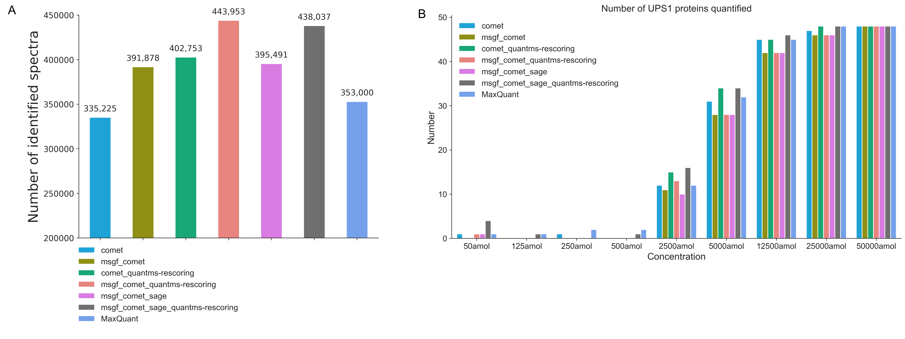
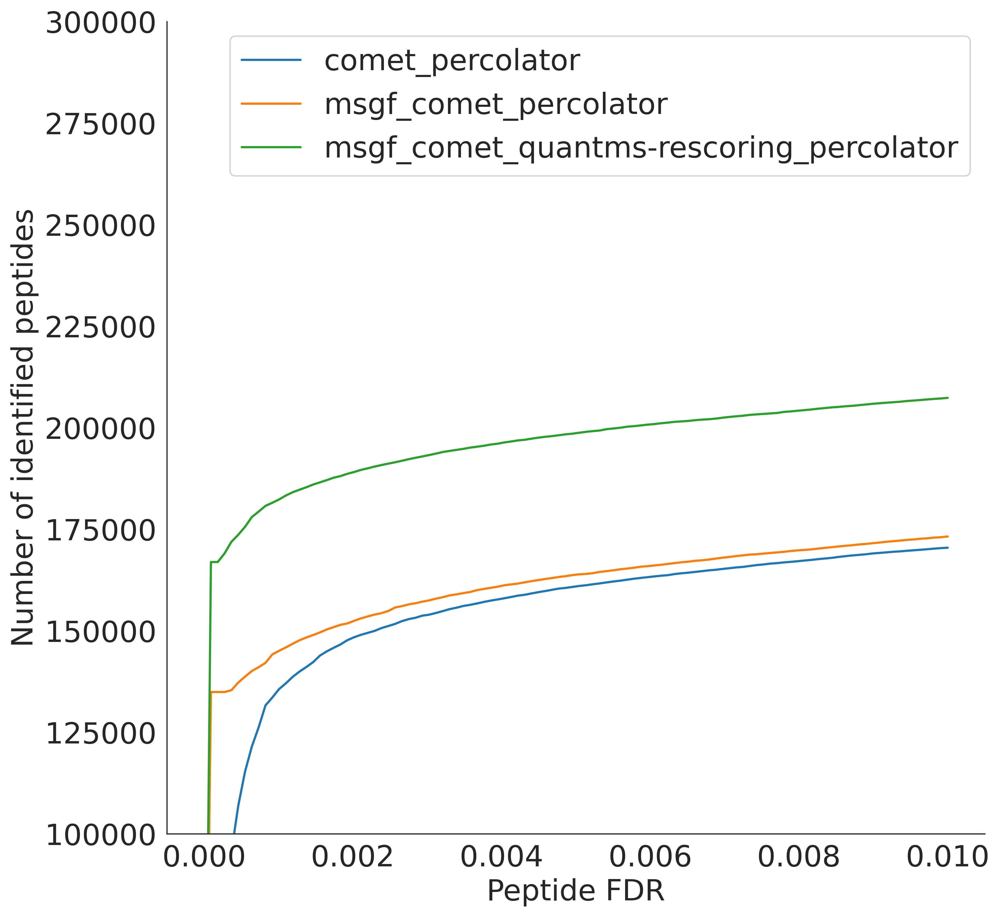

Benchmarks
===============

This section provides **practical examples** of how to run *quantms* on
representative datasets, enabling large-scale, reproducible proteomics reanalysis by integrating multiple search engines with
machine learning-based rescoring.

The examples summarize representative use cases and benchmark results obtained from diverse public datasets.
The goal is to give **end-to-end examples** to reproduce or use as references.

--------------------------------
Label-Free Quantification (LFQ)
--------------------------------

Dataset
-------

This example uses the public LFQ dataset **PXD001819**.

- SDRF file: ``PXD001819.sdrf.tsv``
- Raw data: raw/mzML files
- FASTA database: Human UniProt + contaminants

Running quantms
---------------

Run the LFQ workflow using the following command:

.. code-block:: bash

   nextflow run bigbio/quantms \
     -r 1.7.0 \
     -profile docker \
     --input PXD001819.sdrf.tsv \
     --database uniprot_human_contaminants.fasta \
     --outdir results/lfq_benchmark \
     --add_decoys true \
     --search_engines msgf,comet \
     --targeted_only false \
     --ms2features_enable true \
     --ms2features_generators deeplc,alphapeptdeep

This command performs peptide and protein quantification across multiple
General label-free LC-MS/MS runs.

- Executes multiple search engines in parallel
- calculated ML-derived spectral and retention-time features based on alphapeptdeep and deeplc models
- Applies rescoring to improve PSM confidence and downstream quantification

Outputs
-------

The main outputs are `msstats_in.csv` and `mzTab` files in `quant_tables` folder for peptide-level quantitative table. Statistics can be found in pmultiqc folder

Example Results
---------------

**Benchmark Results:**

By running and comparing different configurations of quantms, we found Specifically, combining Comet, MSGF+,
and Sage resulted in a 17.9% increase in identified spectra relative to Comet alone.
Incorporating MS²PIP and DeepLC features through quantms-rescoring provided an additional 10.7% increase.
Overall, quantms achieved 28.6% more PSM identifications than MaxQuant.
In practice analysis, we recommend that Comet and MSGF+ combined with quantms-rescoring is sufficient for balancing depth and efficiency.

PTM-proteomics Analysis
------------------

quantms supports the analysis of **diverse post-translational
modifications (PTMs)** by integrating multi-search-engine results with
machine learning-derived spectral and retention-time features.

To demonstrate this capability, we use a **phosphorylation-enriched dataset**
as a representative and widely used PTM example.

Dataset
-------

This example uses the **PXD026824** public dataset.

- SDRF file: ``PXD026824.sdrf.tsv``
- Raw data: raw/mzML files
- FASTA database: Human UniProt + contaminants

Running quantms
---------------

Run the PTM-proteomics Analysis workflow using the following command:

.. code-block:: bash

   nextflow run bigbio/quantms \
     -r 1.7.0 \
     -profile docker \
     --input PXD026824.sdrf.tsv \
     --database uniprot_human_contaminants.fasta \
     --outdir results/Phospho_benchmark \
     --add_decoys true \
     --search_engines msgf,comet \
     --targeted_only false \
     --enable_mod_localization true \
     --ms2features_enable true \
     --ms2features_generators deeplc,alphapeptdeep

This command performs peptide, protein quantification and PTM localization. We recommend that enabling fine-tuning using ``--ms2features_fine_tuning``
for general PTM analysis, because most of PTM are unseen for existing models. Also you can fine tune the pretrained model by `quantms-rescoring package <https://github.com/bigbio/quantms-rescoring>`_ on prepared train datasets,
and then pass the model file to quantms.

Example Results
---------------

**Benchmark Results:**

.. image:: images/PXD026824_peptdeep_localization_phospho_main_all.png
   :width: 300
   :align: center

By running and comparing different configurations of quantms,
Incorporating quantms-rescoring features into the two-search-engine consensus further increased the number of identified spectra by 24%.
At the phosphosite level, the quantms-rescoring workflow uncovered 842 novel protein phosphorylation sites not detected in the other
workflow configuration, and an additional 495 sites when considering the modloss ions.
Together, we recommend that enabling quantms-rescoring and even fine-tuning for PTM analysis when model is available in practice analysis.

----------------------------------------

Immunopeptidomics
-----------------

quantms supports the analysis of **immunopeptidomics datasets**
characterized by non-specific peptides. An HLA class II immunopeptidomics dataset containing non-specific peptides was
reanalyzed.

Dataset
-------

This example uses **PXD019643** public datasets.

- SDRF file: ``PXD019643.sdrf.tsv``
- Raw data: raw/mzML files
- FASTA database: Human UniProt + contaminants

Running quantms
---------------

Run the Immunopeptidomics workflow using the following command:

.. code-block:: bash

   nextflow run bigbio/quantms \
     -r 1.7.0 \
     -profile docker \
     --input PXD019643.sdrf.tsv \
     --database uniprot_human_contaminants.fasta \
     --outdir results/lfq_benchmark \
     --add_decoys true \
     --search_engines msgf,comet \
     --targeted_only false \
     --run_fdr_cutoff 0.01 \
     --id_only true \
     --ms2features_range by_sample \
     --fdr_level peptide_level_fdrs \
     --ms2features_best true \
     --ms2features_enable true \
     --ms2features_generators deeplc,alphapeptdeep

For Immunopeptidomics analysis, setting fdr level as peptide level to obtain peptide results. And considering different rescoring range for different experimental designs and aims.

.. note:: This command performs Immunopeptides identification. quantms doesn't currently support the quantification of immunopeptides.

Example Results
---------------

**Benchmark Results:**

By benchmarking, integrating MSGF+ with Comet increased the number of identified peptides by 1.6% compared to using Comet alone.
Adding quantms-rescoring features on top of the Comet workflow yielded a further 14% improvement compared to MSGF+ with the Comet workflow.
Enabling the quantms-rescoring combined with MSGF+ and Comet, the peptide identification improved by an additional 5% compared to workflows using only Comet
and quantms-rescoring. Therefore, it is strongly recommended that the quantms-rescoring function be enabled.

----------------------------------------

TMT Isobaric Proteomics
----------------------------

quantms supports **isobaric labeling-based quantitative proteomics**.

To demonstrate this capability, a **TMT 10-plex clear cell renal cell carcinoma
(ccRCC) dataset** was used as a representative example of multiplexed tumor
proteomics.

Dataset
-------

This example uses **PDC000127** public datasets from CPTAC.

- SDRF file: ``PDC000127.sdrf.tsv``
- Raw data: raw/mzML files
- FASTA database: Human UniProt + contaminants

Running quantms
---------------

Run the Isobaric workflow using the following command:

.. code-block:: bash

   nextflow run bigbio/quantms \
     -r 1.7.0 \
     -profile docker \
     --input PDC000127.sdrf.tsv \
     --database uniprot_human_contaminants.fasta \
     --outdir results/tmt_benchmark \
     --add_decoys true \
     --search_engines msgf,comet \
     --ms2features_enable true \
     --ms2features_generators deeplc,ms2pip \
     --ms2features_model TMT
     --ms2features_model_dir /TMT/

This command performs peptide, protein quantification using multiple search engines combined with quantms-rescoring.
Select `MS2PIP TMT` as the MS2 intensity model, and model folder that stored model weights.
This avoids duplicate downloads and enables quantms with quantms-rescoring on offline HPC.

Example Results
---------------

By running and comparing different configuration of quantms, Some results are as follows:

.. image:: images/PDC_ms2rescore_v1.jpg
   :width: 300
   :align: center

----------------------------------------

Compared to Comet alone, integrating multiple search engines combined with quantms-rescoring increased the PSM identification rate by 14%,
resulting in 1369 additional quantified proteins. In practice analysis, we can also use Comet and MSGF+ combined with quantms-rescoring to
balance performance and efficiency.

--------------------------------------
Data-Independent Acquisition (DIA)
--------------------------------------

Dataset
-------

This example uses the public datasets **PXD026600**:

- SDRF file: ``PXD026600.sdrf.tsv``
- raw/mzML/.d DIA files
- FASTA database with gene annotations

Running quantms
---------------

.. code-block:: bash

   nextflow run bigbio/quantms \
     -r 1.7.0 \
     -profile test_dia,docker \
     --input PXD026600.sdrf.tsv \
     --database uniprot_contaminants_with_genes.fasta \
     --performance_mode true \
     --mass_acc_automatic true \
     --outdir results/dia_benchmark

quantms, uses `DIANN <https://github.com/vdemichev/DiaNN>`_ for DIA library-based and library-free data processing.
Set ``--performance_mode true`` for more efficient and memory-conserving operation.
However, this may come at the expense of some identification depth. Specifying ``diann_speclib`` when enabling library-based
analysis. At times, it is not necessary to build an empirical library based on all spectral data, for instance where multiple technical replicates exist.
You can set ``--random_preanalysis true`` to randomly sample ``empirical_assembly_ms_n`` files for building an empirical library

Outputs
-------

- ``quant_tables/*.tsv``
  Peptide and protein quantitative tables

- ``pmultiqc``
  pMultiqc report for DIA-specific QC metrics